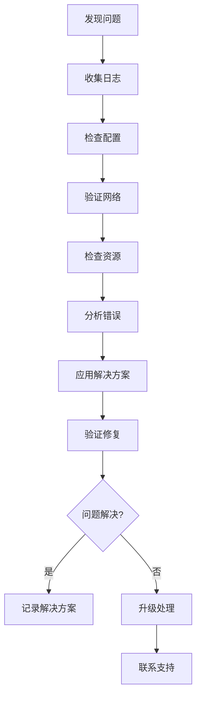

# Carrot YARN 故障排除指南

本文档提供 Carrot YARN 常见问题的诊断和解决方案。

## 📋 目录

- [通用故障排除](#通用故障排除)
- [ResourceManager 问题](#resourcemanager-问题)
- [NodeManager 问题](#nodemanager-问题)
- [ApplicationMaster 问题](#applicationmaster-问题)
- [网络问题](#网络问题)
- [性能问题](#性能问题)
- [监控问题](#监控问题)
- [安全问题](#安全问题)
- [部署问题](#部署问题)
- [诊断工具](#诊断工具)

## 🔧 通用故障排除

### 问题诊断流程



### 快速检查清单

-   [ ] 检查所有组件是否正在运行
-   [ ] 验证网络连接
-   [ ] 检查磁盘空间
-   [ ] 查看最新的错误日志
-   [ ] 验证配置文件语法
-   [ ] 检查防火墙规则
-   [ ] 验证权限设置

### 日志收集

#### 基本日志位置

```bash
# 默认日志目录
/var/log/carrot/

# 组件日志文件
/var/log/carrot/resourcemanager.log
/var/log/carrot/rmnm.log
/var/log/carrot/applicationmaster.log

# 容器日志
/var/log/carrot/containers/
```

#### 日志收集脚本

```bash
#!/bin/bash
# collect-logs.sh

LOG_DIR="/var/log/carrot"
OUTPUT_DIR="/tmp/carrot-logs-$(date +%Y%m%d-%H%M%S)"

mkdir -p "$OUTPUT_DIR"

# 收集组件日志
cp -r "$LOG_DIR"/* "$OUTPUT_DIR/"

# 收集系统信息
echo "=== System Information ===" > "$OUTPUT_DIR/system-info.txt"
uname -a >> "$OUTPUT_DIR/system-info.txt"
free -h >> "$OUTPUT_DIR/system-info.txt"
df -h >> "$OUTPUT_DIR/system-info.txt"

# 收集进程信息
echo "=== Process Information ===" > "$OUTPUT_DIR/process-info.txt"
ps aux | grep carrot >> "$OUTPUT_DIR/process-info.txt"

# 收集网络信息
echo "=== Network Information ===" > "$OUTPUT_DIR/network-info.txt"
netstat -tuln >> "$OUTPUT_DIR/network-info.txt"

# 打包日志
tar -czf "carrot-logs-$(date +%Y%m%d-%H%M%S).tar.gz" -C /tmp "$(basename "$OUTPUT_DIR")"

echo "Logs collected in: carrot-logs-$(date +%Y%m%d-%H%M%S).tar.gz"
```

## 🏢 ResourceManager 问题

### 启动失败

#### 症状

- ResourceManager 进程无法启动
- 启动后立即退出
- 端口绑定失败

#### 常见原因和解决方案

**端口已被占用**

```bash
# 检查端口使用情况
netstat -tuln | grep 8088
lsof -i :8088

# 停止占用端口的进程
sudo kill -9 <PID>

# 或修改配置文件中的端口
vim config.yaml
# resourcemanager.rmserver.port: 8089
```

**权限不足**

```bash
# 检查目录权限
ls -la /var/log/carrot/
ls -la /var/lib/carrot/

# 设置正确权限
sudo chown -R carrot:carrot /var/log/carrot/
sudo chown -R carrot:carrot /var/lib/carrot/
sudo chmod 755 /var/log/carrot/
sudo chmod 755 /var/lib/carrot/
```

**内存不足**

```bash
# 检查内存使用
free -h

# 调整 JVM 堆大小
export RM_HEAP_SIZE=2048m

# 或在配置文件中设置
vim config.yaml
# jvm:
#   heap_size: "2048m"
```

### 应用程序调度问题

#### 症状

- 应用程序长时间处于 ACCEPTED 状态
- 应用程序调度失败
- 资源分配异常

#### 诊断步骤

```bash
# 检查集群资源
curl http://localhost:8088/api/v1/cluster/metrics

# 检查队列状态
curl http://localhost:8088/api/v1/scheduler

# 检查节点状态
curl http://localhost:8088/api/v1/nodes

# 查看调度器日志
grep -i "scheduler" /var/log/carrot/resourcemanager.log
```

#### 解决方案

**资源不足**

```bash
# 检查集群总资源
curl http://localhost:8088/api/v1/cluster/metrics | jq '.data.memory_available'

# 增加节点或调整资源配置
vim rmnm-config.yaml
# resources:
#   memory: 16384
#   vcores: 16
```

**队列配置问题**

```xml
<!-- 检查 capacity-scheduler.xml -->
<property>
  <name>yarn.scheduler.capacity.root.default.capacity</name>
  <value>100</value> <!-- 确保有足够容量 -->
</property>
```

### 节点连接问题

#### 症状

- 节点无法注册到 ResourceManager
- 节点心跳丢失
- 节点状态异常

#### 诊断命令

```bash
# 检查节点连接
curl http://localhost:8088/api/v1/nodes

# 测试网络连接
telnet <rm-host> 8088

# 检查防火墙
sudo iptables -L | grep 8088
sudo ufw status
```

## 🖥️ NodeManager 问题

### 容器启动失败

#### 症状

- 容器无法启动
- 容器启动后立即退出
- 容器资源限制错误

#### 常见原因和解决方案

**磁盘空间不足**

```bash
# 检查磁盘使用情况
df -h

# 清理临时文件
sudo rm -rf /tmp/carrot-*

# 清理容器缓存
sudo rm -rf /var/lib/carrot/cache/*

# 配置自动清理
vim config.yaml
# rmnm:
#   containers:
#     cleanup_interval: "10m"
```

**资源限制问题**

```bash
# 检查系统资源限制
ulimit -a

# 设置更高的限制
ulimit -n 65536
ulimit -u 32768

# 永久设置
echo "* soft nofile 65536" >> /etc/security/limits.conf
echo "* hard nofile 65536" >> /etc/security/limits.conf
```

**用户权限问题**

```bash
# 检查容器用户
id carrot

# 创建用户
sudo useradd -r -s /bin/false carrot

# 设置用户权限
sudo usermod -a -G docker carrot
```

### 心跳超时

#### 症状

- NodeManager 在 ResourceManager 中显示为 LOST
- 心跳连接频繁断开

#### 解决方案

```bash
# 检查网络延迟
ping <rm-host>

# 调整心跳配置
vim config.yaml
# rmnm:
#   resourcemanager:
#     heartbeat_interval: "3s"
#     heartbeat_timeout: "30s"

# 检查时钟同步
ntpdate -q pool.ntp.org
```

### 本地化失败

#### 症状

- 应用程序依赖下载失败
- 本地化超时错误

#### 诊断和解决

```bash
# 检查本地化目录权限
ls -la /var/lib/carrot/cache/

# 测试下载连接
wget <dependency-url>

# 调整本地化配置
vim config.yaml
# rmnm:
#   localizer:
#     download_timeout: "30m"
#     concurrent_downloads: 10
```

## 📱 ApplicationMaster 问题

### AM 容器分配失败

#### 症状

- ApplicationMaster 容器无法分配
- 应用程序停留在 SUBMITTED 状态

#### 解决方案

```bash
# 检查 AM 资源要求
curl http://localhost:8088/api/v1/applications/<app-id>

# 检查集群可用资源
curl http://localhost:8088/api/v1/cluster/metrics

# 调整 AM 资源要求
vim application-spec.json
# {
#   "am_container_spec": {
#     "resource": {
#       "memory": 512,
#       "vcores": 1
#     }
#   }
# }
```

### AM 注册失败

#### 症状

- ApplicationMaster 无法向 ResourceManager 注册
- AM 启动后立即失败

#### 诊断步骤

```bash
# 检查 AM 日志
docker logs <am-container-id>

# 测试 RM 连接
telnet <rm-host> 8088

# 检查认证配置
curl -H "Authorization: Bearer <token>" \
  http://localhost:8088/api/v1/cluster/info
```

### 容器请求失败

#### 症状

- AM 无法获得所需容器
- 容器分配超时

#### 解决方案

```bash
# 检查资源请求是否合理
# 确保请求的资源不超过节点容量

# 调整放置约束
vim am-config.yaml
# placement_constraints:
#   node_affinity:
#     required: false
#   locality_delay: 3
```

## 🌐 网络问题

### 连接超时

#### 症状

- 组件间通信超时
- API 请求失败

#### 诊断工具

```bash
# 测试端口连通性
nc -zv <host> <port>

# 检查路由
traceroute <host>

# 监控网络流量
tcpdump -i any port 8088

# 检查 DNS 解析
nslookup <hostname>
```

#### 解决方案

```bash
# 调整超时配置
vim config.yaml
# network:
#   timeout:
#     connect: "60s"
#     read: "60s"
#     write: "60s"

# 检查防火墙规则
sudo iptables -L
sudo ufw status

# 开放必要端口
sudo ufw allow 8088
sudo ufw allow 8042
sudo ufw allow 8080
```

### 负载均衡问题

#### 症状

- 请求分布不均
- 某些节点过载

#### 解决方案

```bash
# 检查负载均衡配置
vim lb-config.conf

# 监控请求分布
curl http://localhost:8088/api/v1/nodes | \
  jq '.data.nodes[] | {node_id, num_containers}'

# 调整负载均衡策略
# 配置轮询、最少连接或其他策略
```

## 🚀 性能问题

### 高延迟

#### 症状

- 应用程序启动慢
- 调度延迟高
- API 响应慢

#### 性能调优

```bash
# 监控系统性能
top
htop
iotop

# 检查 JVM 性能
jstack <java-pid>
jmap -histo <java-pid>

# 调整 GC 参数
export JAVA_OPTS="-XX:+UseG1GC -XX:MaxGCPauseMillis=200"

# 调整调度器配置
vim config.yaml
# resourcemanager:
#   scheduler:
#     schedule_interval: "50ms"
#     max_allocation_attempts: 5
```

### 内存泄漏

#### 症状

- 内存使用持续增长
- OutOfMemoryError 错误
- 进程被系统终止

#### 诊断和解决

```bash
# 分析内存使用
jmap -dump:format=b,file=heap.hprof <java-pid>

# 监控内存趋势
watch -n 5 "free -h"

# 调整内存设置
vim config.yaml
# jvm:
#   heap_size: "4g"
#   gc_options: "-XX:+UseG1GC -XX:G1HeapRegionSize=16m"
```

### CPU 使用率高

#### 症状

- CPU 使用率持续在高位
- 系统响应缓慢

#### 解决方案

```bash
# 分析 CPU 热点
perf top
java -jar yourapp.jar -XX:+FlightRecorder

# 调整线程池配置
vim config.yaml
# threadpool:
#   core_size: 10
#   max_size: 50
#   queue_size: 1000

# 限制资源使用
# 使用 cgroups 限制 CPU 使用
```

## 📊 监控问题

### 指标收集失败

#### 症状

- Prometheus 无法采集指标
- Grafana 显示无数据

#### 解决方案

```bash
# 检查 Prometheus 配置
vim prometheus.yml
# - job_name: 'carrot'
#   static_configs:
#   - targets: ['localhost:9090']

# 测试指标端点
curl http://localhost:9090/metrics

# 检查网络连接
telnet localhost 9090

# 重启监控服务
sudo systemctl restart prometheus
sudo systemctl restart grafana-rmserver
```

### 告警规则问题

#### 症状

- 告警不触发
- 误报告警

#### 调试方法

```bash
# 验证告警规则语法
promtool check rules alert-rules.yml

# 测试告警条件
curl 'http://localhost:9090/api/v1/query?query=up{job="carrot"}'

# 检查告警状态
curl http://localhost:9090/api/v1/alerts
```

## 🔐 安全问题

### 认证失败

#### 症状

- JWT token 验证失败
- 401 Unauthorized 错误

#### 解决方案

```bash
# 检查 token 是否过期
jwt-decode <token>

# 验证密钥配置
vim config.yaml
# security:
#   authentication:
#     jwt:
#       secret_key: "your-secret-key"

# 重新生成 token
curl -X POST http://localhost:8088/api/v1/auth/login \
  -H "Content-Type: application/json" \
  -d '{"username":"admin","password":"password"}'
```

### 权限拒绝

#### 症状

- 403 Forbidden 错误
- 无权限访问资源

#### 解决方案

```bash
# 检查用户权限
curl http://localhost:8088/api/v1/user/permissions

# 更新 ACL 配置
vim config.yaml
# security:
#   authorization:
#     admin_acl:
#       users: ["admin", "newuser"]

# 重新加载配置
curl -X POST http://localhost:8088/api/v1/config/reload
```

## 🐳 部署问题

### Docker 容器问题

#### 症状

- 容器启动失败
- 容器异常退出

#### 解决方案

```bash
# 检查容器日志
docker logs <container-id>

# 检查容器资源限制
docker stats <container-id>

# 进入容器调试
docker exec -it <container-id> /bin/bash

# 检查镜像
docker inspect <image-name>

# 重建镜像
docker build --no-cache -t carrot:latest .
```

### Kubernetes 部署问题

#### 症状

- Pod 无法启动
- 服务无法访问

#### 诊断命令

```bash
# 检查 Pod 状态
kubectl get pods -o wide

# 查看 Pod 日志
kubectl logs <pod-name>

# 描述 Pod 详情
kubectl describe pod <pod-name>

# 检查服务
kubectl get svc
kubectl describe svc <service-name>

# 检查配置
kubectl get configmap
kubectl describe configmap <configmap-name>
```

## 🛠️ 诊断工具

### 内置诊断命令

```bash
# 健康检查
carrot health check --all

# 配置验证
carrot config validate --config config.yaml

# 连接测试
carrot network test --target <host:port>

# 性能分析
carrot perf analyze --duration 60s
```

### 第三方工具

#### 系统监控

```bash
# htop - 进程监控
sudo apt install htop
htop

# iotop - IO 监控
sudo apt install iotop
sudo iotop

# netstat - 网络监控
netstat -tuln
ss -tuln
```

#### 应用监控

```bash
# jstack - Java 线程dump
jstack <java-pid>

# jmap - Java 内存分析
jmap -histo <java-pid>
jmap -dump:format=b,file=heap.hprof <java-pid>

# jstat - JVM 统计
jstat -gc <java-pid> 1s
```

### 日志分析脚本

```bash
#!/bin/bash
# analyze-logs.sh

LOG_FILE="$1"

echo "=== Error Analysis ==="
grep -i "error\|exception\|failed" "$LOG_FILE" | head -20

echo "=== Warning Analysis ==="
grep -i "warn" "$LOG_FILE" | head -10

echo "=== Performance Analysis ==="
grep -i "slow\|timeout\|delay" "$LOG_FILE" | head -10

echo "=== Connection Analysis ==="
grep -i "connect\|disconnect\|timeout" "$LOG_FILE" | head -10
```

## 📚 相关文档

- [🏗️ 系统架构](./系统架构.md) - 理解系统设计
- [⚙️ 配置参考](./配置参考.md) - 配置选项详解
- [📊 API 参考](./API参考.md) - API 使用说明
- [📖 核心概念](./核心概念.md) - 理解基本概念
