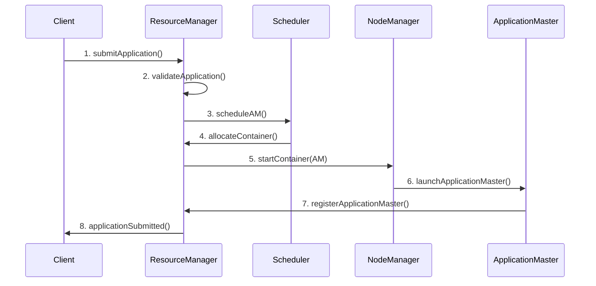

# Carrot YARN 核心概念

本文档详细介绍 Carrot YARN 的核心概念，帮助您更好地理解系统的工作原理。

## 🏗️ YARN 基础概念

### 什么是 YARN？

YARN (Yet Another Resource Negotiator) 是一个集群资源管理系统，它将资源管理和作业调度/监控功能分离，提供了一个通用的资源管理平台。

### YARN 的核心思想

1. **资源抽象**: 将集群资源抽象为统一的资源模型
2. **应用程序框架**: 支持多种计算框架（MapReduce、Spark、Flink 等）
3. **多租户**: 支持多用户、多应用程序并发执行
4. **资源隔离**: 确保应用程序之间的资源隔离

## 🎯 Carrot YARN 核心组件

### 1. ResourceManager (RM)

ResourceManager 是 YARN 的核心组件，负责整个集群的资源管理和调度。

#### 主要职责

-   **资源管理**: 跟踪集群中所有节点的资源状态
-   **应用程序管理**: 接收、验证和调度应用程序
-   **调度决策**: 根据调度策略分配资源
-   **故障恢复**: 处理节点和应用程序故障

#### 核心模块

```go
type ResourceManager struct {
    // 应用程序管理
    applicationManager *ApplicationManager

    // 节点管理
    nodeManager *NodeManager

    // 调度器
    scheduler Scheduler

    // 安全管理
    securityManager *SecurityManager

    // 恢复管理
    recoveryManager *RecoveryManager
}
```

### 2. NodeManager (NM)

NodeManager 运行在集群的每个工作节点上，负责该节点的资源管理和容器执行。

#### 主要职责

-   **容器管理**: 启动、监控、停止容器
-   **资源监控**: 监控节点资源使用情况
-   **心跳通信**: 向 ResourceManager 报告状态
-   **本地化**: 下载和管理应用程序依赖

#### 核心模块

```go
type NodeManager struct {
    // 容器管理
    containerManager *ContainerManager

    // 资源管理
    resourceManager *NodeResourceManager

    // 本地化器
    localizer *Localizer

    // 状态管理
    statusManager *StatusManager
}
```

### 3. ApplicationMaster (AM)

ApplicationMaster 是每个应用程序的协调者，负责管理应用程序的生命周期。

#### 主要职责

-   **资源请求**: 向 ResourceManager 请求容器
-   **任务调度**: 将任务分配给容器
-   **状态监控**: 监控任务执行状态
-   **故障处理**: 处理任务失败和重试

#### 核心模块

```go
type ApplicationMaster struct {
    // RM 客户端
    rmClient *RMClient

    // NM 客户端
    nmClient *NMClient

    // 应用程序实现
    application Application

    // HTTP 服务器
    httpServer *HTTPServer
}
```

### 4. Client

Client 是用户与 YARN 集群交互的接口。

#### 主要功能

-   **应用程序提交**: 将应用程序提交到集群
-   **状态查询**: 查询应用程序和集群状态
-   **日志获取**: 获取应用程序日志
-   **管理操作**: 应用程序的启动、停止等操作

## 📊 资源模型

### 1. 资源类型

Carrot YARN 支持多种资源类型：

```go
type ResourceSpec struct {
    CPU         float64 `json:"cpu"`          // CPU 请求量（核心数）
    Memory      int64   `json:"memory"`       // 内存请求量（MB）
    CPULimit    float64 `json:"cpu_limit"`    // CPU 限制量（核心数）
    MemoryLimit int64   `json:"memory_limit"` // 内存限制量（MB）
}

type Resource struct {
    Memory int64 `json:"memory"` // 内存（MB）
    VCores int32 `json:"vcores"` // 虚拟核心数
}
```

### 2. 资源分配

#### 最小分配单位

-   **内存**: 512 MB
-   **CPU**: 0.1 vCore

#### 资源分配策略

-   **Requests vs Limits**: 支持请求量和限制量
-   **QoS 类别**: Guaranteed、Burstable、BestEffort
-   **资源预留**: 防止资源碎片化

### 3. 资源隔离

#### 进程隔离

```go
type ContainerExecutor interface {
    LaunchContainer(container *Container) error
    SignalContainer(containerID string, signal os.Signal) error
    DeleteAsUser(user, path string) error
}
```

#### Cgroups 隔离（规划中）

-   **CPU 隔离**: 限制 CPU 使用
-   **内存隔离**: 限制内存使用
-   **IO 隔离**: 限制磁盘和网络 IO

## 🔄 应用程序生命周期

### 1. 应用程序状态

```go
const (
    ApplicationStateNew       = "NEW"
    ApplicationStateSubmitted = "SUBMITTED"
    ApplicationStateAccepted  = "ACCEPTED"
    ApplicationStateRunning   = "RUNNING"
    ApplicationStateFinished  = "FINISHED"
    ApplicationStateFailed    = "FAILED"
    ApplicationStateKilled    = "KILLED"
)
```

### 2. 状态转换

```
NEW → SUBMITTED → ACCEPTED → RUNNING → (FINISHED/FAILED/KILLED)
 ↓         ↓          ↓         ↓              ↓
错误      错误        错误      错误           完成
 ↓         ↓          ↓         ↓              ↓
FAILED   FAILED    FAILED    FAILED      FINISHED
```

### 3. 应用程序提交流程



## 📦 容器概念

### 1. 容器定义

容器是 YARN 中资源分配的基本单位，它封装了：

-   **资源规格**: CPU、内存等资源量
-   **执行环境**: 环境变量、工作目录
-   **安全上下文**: 用户、权限等
-   **本地化资源**: 应用程序依赖文件

### 2. 容器状态

```go
const (
    ContainerStateNew      = "NEW"
    ContainerStateRunning  = "RUNNING"
    ContainerStateComplete = "COMPLETE"
    ContainerStateFailed   = "FAILED"
)
```

### 3. 容器生命周期

```
NEW → RUNNING → (COMPLETE/FAILED)
 ↓       ↓           ↓
失败    失败        完成
 ↓       ↓           ↓
FAILED  FAILED   COMPLETE
```

## 🗂️ 调度概念

### 1. 调度器类型

#### FIFO 调度器

-   **特点**: 先进先出，简单公平
-   **适用场景**: 单用户、批处理作业
-   **优缺点**: 简单但可能导致饥饿

#### Capacity 调度器

-   **特点**: 基于队列容量的层次化调度
-   **适用场景**: 多租户环境
-   **优缺点**: 灵活但配置复杂

#### Fair 调度器

-   **特点**: 公平共享资源
-   **适用场景**: 交互式作业
-   **优缺点**: 公平但可能影响吞吐量

### 2. 调度策略

#### 资源分配策略

```go
type SchedulingPolicy struct {
    // 资源分配模式
    AllocationMode string `json:"allocation_mode"` // incremental, continuous

    // 节点选择策略
    NodeLocalityDelay int `json:"node_locality_delay"`

    // 抢占策略
    PreemptionEnabled bool `json:"preemption_enabled"`
}
```

#### 优先级调度

-   **应用程序优先级**: 不同应用程序的优先级
-   **队列优先级**: 不同队列的优先级
-   **任务优先级**: 同一应用程序内任务的优先级

### 3. 放置约束

#### 节点选择

```go
type PlacementConstraint struct {
    // 节点亲和性
    NodeAffinity *NodeAffinity `json:"node_affinity,omitempty"`

    // 节点反亲和性
    NodeAntiAffinity *NodeAntiAffinity `json:"node_anti_affinity,omitempty"`

    // 标签选择器
    NodeSelector map[string]string `json:"node_selector,omitempty"`
}
```

#### 数据本地性

-   **Node Local**: 数据在同一节点
-   **Rack Local**: 数据在同一机架
-   **Off Switch**: 数据在不同机架

## 🔐 安全概念

### 1. 认证机制

#### Token 认证

```go
type TokenManager struct {
    // JWT 密钥
    secretKey []byte

    // Token 过期时间
    expiration time.Duration

    // Token 存储
    tokenStore TokenStore
}
```

#### 其他认证方式

-   **Simple 认证**: 基于用户名的简单认证
-   **Kerberos 认证**: 企业级安全认证
-   **LDAP 认证**: 基于 LDAP 的认证

### 2. 授权机制

#### 访问控制列表 (ACL)

```go
type ACL struct {
    // 用户列表
    Users []string `json:"users"`

    // 用户组列表
    Groups []string `json:"groups"`

    // 权限列表
    Permissions []Permission `json:"permissions"`
}
```

#### 权限类型

-   **Submit**: 提交应用程序
-   **Admin**: 管理员权限
-   **View**: 查看权限
-   **Modify**: 修改权限

### 3. 安全隔离

#### 用户隔离

-   **容器用户**: 不同用户的容器使用不同的系统用户
-   **文件权限**: 严格的文件访问控制
-   **进程隔离**: 进程级别的安全隔离

## 📈 监控概念

### 1. 指标体系

#### 系统指标

-   **集群指标**: 节点数量、资源利用率
-   **应用程序指标**: 运行、完成、失败的应用程序数量
-   **容器指标**: 容器分配、完成、失败数量

#### 性能指标

-   **吞吐量**: 应用程序提交、完成速率
-   **延迟**: 应用程序调度、启动延迟
-   **利用率**: CPU、内存资源利用率

### 2. 健康检查

#### 组件健康检查

```go
type HealthChecker interface {
    CheckHealth() HealthStatus
    GetHealthReport() HealthReport
}

type HealthStatus string

const (
    HealthStatusHealthy   HealthStatus = "HEALTHY"
    HealthStatusUnhealthy HealthStatus = "UNHEALTHY"
    HealthStatusUnknown   HealthStatus = "UNKNOWN"
)
```

#### 节点健康检查

-   **心跳监控**: 节点心跳超时检测
-   **资源监控**: 资源使用异常检测
-   **磁盘监控**: 磁盘空间和健康检查

### 3. 告警机制

#### 告警规则

```yaml
alerts:
    - name: "NodeDown"
      condition: "node_heartbeat_timeout > 60s"
      severity: "critical"

    - name: "HighMemoryUsage"
      condition: "memory_usage_percent > 90"
      severity: "warning"
```

## 🔧 配置概念

### 1. 配置层次

#### 系统级配置

-   **集群配置**: 集群范围的全局配置
-   **组件配置**: 各组件的特定配置
-   **安全配置**: 安全相关配置

#### 应用程序级配置

-   **应用程序配置**: 应用程序特定配置
-   **容器配置**: 容器运行时配置
-   **环境配置**: 环境变量配置

### 2. 配置管理

#### 配置格式

-   **YAML**: 主要配置格式
-   **JSON**: API 交互格式
-   **环境变量**: 12-Factor 应用配置

#### 动态配置

```go
type ConfigManager interface {
    GetConfig(key string) (interface{}, error)
    SetConfig(key string, value interface{}) error
    WatchConfig(key string) (<-chan interface{}, error)
}
```

## 🌐 网络概念

### 1. 通信协议

#### HTTP/REST

-   **ResourceManager API**: RESTful API
-   **NodeManager API**: RESTful API
-   **ApplicationMaster API**: RESTful API

#### 心跳协议

```go
type HeartbeatRequest struct {
    NodeID      NodeID                `json:"node_id"`
    NodeStatus  NodeStatus            `json:"node_status"`
    Containers  []ContainerStatus     `json:"containers"`
    Timestamp   time.Time             `json:"timestamp"`
}

type HeartbeatResponse struct {
    Commands    []NodeCommand         `json:"commands"`
    Timestamp   time.Time             `json:"timestamp"`
}
```

### 2. 服务发现

#### 静态发现

-   **配置文件**: 在配置文件中指定服务地址
-   **环境变量**: 通过环境变量指定服务地址

#### 动态发现（规划中）

-   **Consul**: 使用 Consul 进行服务发现
-   **etcd**: 使用 etcd 进行服务发现
-   **Kubernetes**: 使用 Kubernetes 服务发现

## 📚 扩展概念

### 1. 插件架构

#### 调度器插件

```go
type SchedulerPlugin interface {
    Name() string
    PreFilter(context.Context, *Pod, []*Node) *PreFilterResult
    Filter(context.Context, *Pod, *Node) *FilterResult
    Score(context.Context, *Pod, *Node) *ScoreResult
}
```

#### 存储插件

```go
type StateStore interface {
    Save(key string, value interface{}) error
    Load(key string, value interface{}) error
    Delete(key string) error
}
```

### 2. 应用程序框架

#### 框架接口

```go
type ApplicationFramework interface {
    Name() string
    SubmitApplication(spec *ApplicationSpec) (*Application, error)
    GetApplicationStatus(appID string) (*ApplicationStatus, error)
}
```

#### 内置框架

-   **Simple**: 简单的任务执行框架
-   **Distributed**: 分布式计算框架
-   **MapReduce**: MapReduce 计算框架（规划中）

## 🔍 故障恢复概念

### 1. 故障类型

#### 节点故障

-   **硬件故障**: 节点硬件失效
-   **网络故障**: 节点网络连接问题
-   **软件故障**: NodeManager 进程崩溃

#### 应用程序故障

-   **ApplicationMaster 故障**: AM 进程崩溃
-   **容器故障**: 容器执行失败
-   **任务故障**: 任务执行异常

### 2. 故障处理

#### 自动恢复

```go
type RecoveryManager struct {
    // 恢复策略
    policy RecoveryPolicy

    // 状态存储
    stateStore StateStore

    // 恢复处理器
    handlers map[string]RecoveryHandler
}
```

#### 故障转移

-   **ResourceManager HA**: ResourceManager 高可用
-   **应用程序重试**: ApplicationMaster 重启
-   **任务重试**: 失败任务的重新执行

## 📖 相关文档

-   [🏗️ 系统架构](./系统架构.md) - 详细的架构设计
-   [📦 快速安装指南](./快速安装指南.md) - 快速搭建集群
-   [🔧 开发指南](./开发指南.md) - 开发环境和规范
-   [⚙️ 配置参考](./配置参考.md) - 完整配置选项
