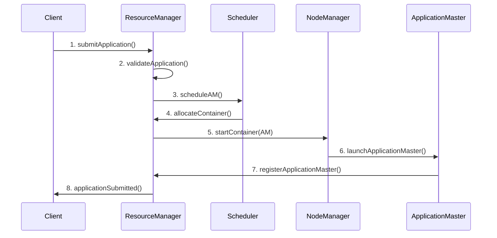
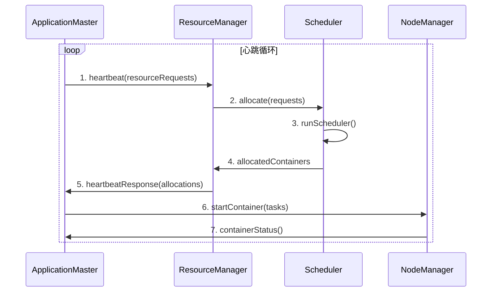
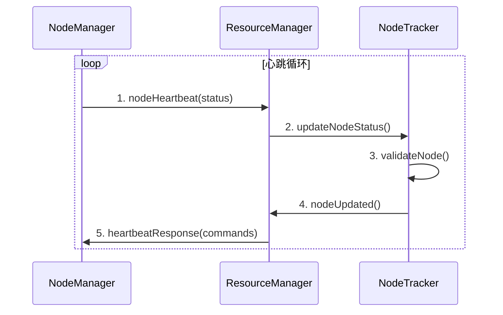

# Carrot YARN 系统架构

## 📐 架构概览

Carrot YARN 采用分层的微服务架构设计，确保高可用性、可扩展性和可维护性。系统由四个核心组件组成：ResourceManager、NodeManager、ApplicationMaster
和 Client。

## 🏗️ 分层架构

### 1. 客户端层 (Client Layer)

```
┌─────────────────────────────────────────────────────────┐
│                    Client Layer                         │
├─────────────────────────────────────────────────────────┤
│  ┌─────────────┐  ┌─────────────┐  ┌─────────────┐      │
│  │   CLI Tool  │  │   Web UI    │  │  REST API   │      │
│  │             │  │             │  │             │      │
│  │ - 应用提交   │  │ - 集群监控   │  │ - 程序集成   │     │
│  │ - 状态查询   │  │ - 任务管理   │  │ - 批量操作   │     │
│  │ - 日志获取   │  │ - 性能分析   │  │ - 自动化    │     │
│  └─────────────┘  └─────────────┘  └─────────────┘     │
└─────────────────────────────────────────────────────────┘
```

#### 客户端组件

- **CLI 工具**: 命令行接口，支持应用提交、状态监控等操作
- **Web UI**: 基于 React 的可视化管理界面
- **REST API**: RESTful API 接口，支持第三方系统集成

### 2. 资源管理层 (ResourceManager Layer)

```
┌─────────────────────────────────────────────────────────┐
│                ResourceManager Layer                   │
├─────────────────────────────────────────────────────────┤
│  ┌─────────────────────────────────────────────────────┐ │
│  │               ResourceManager                       │ │
│  ├─────────────────────────────────────────────────────┤ │
│  │  Core Modules                                       │ │
│  │  ┌─────────────┐ ┌─────────────┐ ┌─────────────┐   │ │
│  │  │ApplicationMgr│ │ NodeManager │ │  Scheduler  │   │ │
│  │  │             │ │             │ │             │   │ │
│  │  │ - 应用管理   │ │ - 节点注册   │ │ - 资源调度   │   │ │
│  │  │ - 生命周期   │ │ - 心跳监控   │ │ - 任务分配   │   │ │
│  │  │ - 状态跟踪   │ │ - 资源跟踪   │ │ - 策略执行   │   │ │
│  │  └─────────────┘ └─────────────┘ └─────────────┘   │ │
│  │                                                     │ │
│  │  Support Modules                                    │ │
│  │  ┌─────────────┐ ┌─────────────┐ ┌─────────────┐   │ │
│  │  │  Security   │ │  Recovery   │ │   Metrics   │   │ │
│  │  │             │ │             │ │             │   │ │
│  │  │ - 认证授权   │ │ - 状态恢复   │ │ - 性能监控   │   │ │
│  │  │ - 访问控制   │ │ - 故障恢复   │ │ - 健康检查   │   │ │
│  │  │ - 审计日志   │ │ - 数据备份   │ │ - 告警通知   │   │ │
│  │  └─────────────┘ └─────────────┘ └─────────────┘   │ │
│  └─────────────────────────────────────────────────────┘ │
└─────────────────────────────────────────────────────────┘
```

#### ResourceManager 核心职责

1. **应用程序管理**: 接收、验证和调度应用程序
2. **资源分配**: 根据调度策略分配集群资源
3. **节点管理**: 监控和管理集群中的 NodeManager
4. **安全控制**: 实现认证、授权和访问控制

### 3. 节点管理层 (NodeManager Layer)

```
┌─────────────────────────────────────────────────────────┐
│                 NodeManager Layer                      │
├─────────────────────────────────────────────────────────┤
│  ┌─────────────┐ ┌─────────────┐ ┌─────────────┐       │
│  │NodeManager 1│ │NodeManager 2│ │NodeManager N│       │
│  ├─────────────┤ ├─────────────┤ ├─────────────┤       │
│  │┌───────────┐│ │┌───────────┐│ │┌───────────┐│       │
│  ││Container  ││ ││Container  ││ ││Container  ││       │
│  ││Manager    ││ ││Manager    ││ ││Manager    ││       │
│  ││           ││ ││           ││ ││           ││       │
│  ││- 容器创建 ││ ││- 容器创建 ││ ││- 容器创建 ││       │
│  ││- 生命周期 ││ ││- 生命周期 ││ ││- 生命周期 ││       │
│  ││- 状态监控 ││ ││- 状态监控 ││ ││- 状态监控 ││       │
│  │└───────────┘│ │└───────────┘│ │└───────────┘│       │
│  │┌───────────┐│ │┌───────────┐│ │┌───────────┐│       │
│  ││Resource   ││ ││Resource   ││ ││Resource   ││       │
│  ││Monitor    ││ ││Monitor    ││ ││Monitor    ││       │
│  ││           ││ ││           ││ ││           ││       │
│  ││- 资源监控 ││ ││- 资源监控 ││ ││- 资源监控 ││       │
│  ││- 性能统计 ││ ││- 性能统计 ││ ││- 性能统计 ││       │
│  ││- 健康检查 ││ ││- 健康检查 ││ ││- 健康检查 ││       │
│  │└───────────┘│ │└───────────┘│ │└───────────┘│       │
│  │┌───────────┐│ │┌───────────┐│ │┌───────────┐│       │
│  ││Localizer  ││ ││Localizer  ││ ││Localizer  ││       │
│  ││           ││ ││           ││ ││           ││       │
│  ││- 资源下载 ││ ││- 资源下载 ││ ││- 资源下载 ││       │
│  ││- 本地缓存 ││ ││- 本地缓存 ││ ││- 本地缓存 ││       │
│  ││- 清理管理 ││ ││- 清理管理 ││ ││- 清理管理 ││       │
│  │└───────────┘│ │└───────────┘│ │└───────────┘│       │
│  └─────────────┘ └─────────────┘ └─────────────┘       │
└─────────────────────────────────────────────────────────┘
```

#### NodeManager 核心职责

1. **容器管理**: 创建、启动、监控和清理容器
2. **资源监控**: 实时监控节点资源使用情况
3. **心跳通信**: 向 ResourceManager 发送状态更新
4. **本地化**: 下载和管理应用程序依赖

### 4. 应用程序层 (Application Layer)

```
┌─────────────────────────────────────────────────────────┐
│               Application Layer                         │
├─────────────────────────────────────────────────────────┤
│  ┌─────────────┐ ┌─────────────┐ ┌─────────────┐       │
│  │    App 1    │ │    App 2    │ │    App N    │       │
│  ├─────────────┤ ├─────────────┤ ├─────────────┤       │
│  │┌───────────┐│ │┌───────────┐│ │┌───────────┐│       │
│  ││Application││ ││Application││ ││Application││       │
│  ││Master     ││ ││Master     ││ ││Master     ││       │
│  ││           ││ ││           ││ ││           ││       │
│  ││- 任务协调 ││ ││- 任务协调 ││ ││- 任务协调 ││       │
│  ││- 资源请求 ││ ││- 资源请求 ││ ││- 资源请求 ││       │
│  ││- 状态管理 ││ ││- 状态管理 ││ ││- 状态管理 ││       │
│  │└───────────┘│ │└───────────┘│ │└───────────┘│       │
│  │┌───────────┐│ │┌───────────┐│ │┌───────────┐│       │
│  ││Containers ││ ││Containers ││ ││Containers ││       │
│  ││           ││ ││           ││ ││           ││       │
│  ││ Task 1    ││ ││ Task 1    ││ ││ Task 1    ││       │
│  ││ Task 2    ││ ││ Task 2    ││ ││ Task 2    ││       │
│  ││ Task ...  ││ ││ Task ...  ││ ││ Task ...  ││       │
│  │└───────────┘│ │└───────────┘│ │└───────────┘│       │
│  └─────────────┘ └─────────────┘ └─────────────┘       │
└─────────────────────────────────────────────────────────┘
```

## 🔄 交互流程

### 1. 应用程序提交流程



### 2. 资源分配流程



### 3. 节点心跳流程



## 📊 数据流架构

### 1. 控制流

```
Client Request → ResourceManager → Scheduler → NodeManager → Container
      ↓              ↓              ↓           ↓            ↓
   Validation → ApplicationMgr → Allocation → Launch → Execution
```

### 2. 数据流

```
Metrics ← ResourceManager ← NodeManager ← Container Monitor
  ↓            ↓              ↓              ↓
Prometheus → Grafana    ← Log Collector ← Application Logs
```

### 3. 事件流

```
Application Events → EventBus → Event Handlers → State Transitions
Container Events   →    ↓    → Notifications  → External Systems
Node Events        →    ↓    → Metrics       → Monitoring
```

## 🔧 核心组件设计

### 1. ResourceManager 内部架构

```go
type ResourceManager struct {
    // 核心管理器
    applicationManager *applicationmanager.ApplicationManager
    nodeManager        *nodemanager.NodeManager
    scheduler          scheduler.Scheduler

    // 支持服务
    securityManager    *security.SecurityManager
    recoveryManager    *recovery.RecoveryManager
    metricsManager     *metrics.MetricsManager

    // 通信层
    httpServer         *http.Server
    rpcServer          *grpc.Server

    // 配置和状态
    config             *Config
    state              *State
}
```

### 2. NodeManager 内部架构

```go
type NodeManager struct {
    // 核心管理器
    containerManager   *containermanager.ContainerManager
    resourceManager    *noderesourcemanager.ResourceManager
    localizer          *localizer.Localizer

    // 监控和状态
    systemMonitor      *monitor.SystemMonitor
    statusManager      *nodestatusmanager.StatusManager

    // 通信
    rmClient           *RMClient
    httpServer         *http.Server

    // 配置
    config             *Config
}
```

### 3. 调度器架构

```go
type Scheduler interface {
    Schedule(requests []*ResourceRequest) []*Allocation
    GetNodes() []*NodeInfo
    GetQueues() []*QueueInfo
}

// 调度器实现
type CapacityScheduler struct {
    queues      map[string]*CapacityQueue
    nodes       map[string]*NodeInfo
    policy      *SchedulingPolicy
}

type FairScheduler struct {
    pools       map[string]*FairPool
    nodes       map[string]*NodeInfo
    policy      *FairSchedulingPolicy
}
```

## 🚀 性能优化设计

### 1. 并发模型

```go
// ResourceManager 并发处理
func (rm *ResourceManager) processRequests() {
    for {
        select {
        case req := <-rm.requestChan:
            go rm.handleRequest(req)
        case <-rm.stopChan:
            return
        }
    }
}

// 使用 Worker Pool 处理高并发
type WorkerPool struct {
    workers int
    jobs    chan Job
}
```

### 2. 缓存策略

```go
// 多级缓存
type CacheManager struct {
    l1Cache *lru.Cache     // 内存缓存
    l2Cache *redis.Client  // Redis 缓存
    l3Cache *Database      // 数据库
}
```

### 3. 批处理优化

```go
// 批量处理心跳
func (nm *NodeManager) batchHeartbeat() {
    ticker := time.NewTicker(heartbeatInterval)
    batch := make([]*HeartbeatRequest, 0, batchSize)

    for {
        select {
        case hb := <-nm.heartbeatChan:
            batch = append(batch, hb)
            if len(batch) >= batchSize {
                nm.sendBatchHeartbeat(batch)
                batch = batch[:0]
            }
        case <-ticker.C:
            if len(batch) > 0 {
                nm.sendBatchHeartbeat(batch)
                batch = batch[:0]
            }
        }
    }
}
```

## 🔒 安全架构

### 1. 认证层

```
┌─────────────────────────────────────────┐
│               Authentication            │
├─────────────────────────────────────────┤
│  ┌─────────────┐  ┌─────────────┐      │
│  │ JWT Tokens  │  │ LDAP/AD     │      │
│  └─────────────┘  └─────────────┘      │
│  ┌─────────────┐  ┌─────────────┐      │
│  │ Kerberos    │  │ Custom Auth │      │
│  └─────────────┘  └─────────────┘      │
└─────────────────────────────────────────┘
```

### 2. 授权层

```
┌─────────────────────────────────────────┐
│               Authorization             │
├─────────────────────────────────────────┤
│  ┌─────────────┐  ┌─────────────┐      │
│  │ RBAC        │  │ Queue ACLs  │      │
│  └─────────────┘  └─────────────┘      │
│  ┌─────────────┐  ┌─────────────┐      │
│  │ Node Access │  │ App Perms   │      │
│  └─────────────┘  └─────────────┘      │
└─────────────────────────────────────────┘
```

### 3. 传输安全

```go
// TLS 配置
type TLSConfig struct {
    CertFile string
    KeyFile  string
    CAFile   string

    // 双向认证
    ClientAuth tls.ClientAuthType
}
```

## 📈 监控架构

### 1. 指标收集

```
Application Metrics → Prometheus → Grafana Dashboard
Node Metrics       →      ↓      → Alert Manager
System Metrics     → Metrics API → Custom Tools
```

### 2. 日志聚合

```
Application Logs → Fluentd → Elasticsearch → Kibana
Node Logs       →    ↓    → Log Analysis  → Alerts
System Logs     → Logstash → Data Storage → Archive
```

### 3. 分布式追踪

```go
// OpenTracing 集成
func (rm *ResourceManager) handleRequest(ctx context.Context, req *Request) {
    span, ctx := opentracing.StartSpanFromContext(ctx, "handleRequest")
    defer span.Finish()

    // 处理请求
    result, err := rm.processRequest(ctx, req)

    // 记录追踪信息
    span.SetTag("request.id", req.ID)
    span.SetTag("error", err != nil)

    return result, err
}
```

## 🌐 云原生架构

### 1. 容器化部署

```dockerfile
# 多阶段构建
FROM golang:1.21-alpine AS builder
WORKDIR /app
COPY . .
RUN go build -o carrot-rm cmd/resourcemanager/main.go

FROM alpine:latest
RUN apk --no-cache add ca-certificates
COPY --from=builder /app/carrot-rm /usr/local/bin/
ENTRYPOINT ["carrot-rm"]
```

### 2. Kubernetes 集成

```yaml
apiVersion: apps/v1
kind: Deployment
metadata:
  name: carrot-resourcemanager
spec:
  replicas: 2
  selector:
    matchLabels:
      app: carrot-rm
  template:
    metadata:
      labels:
        app: carrot-rm
    spec:
      containers:
        - name: resourcemanager
          image: carrot/resourcemanager:latest
          ports:
            - containerPort: 8088
          env:
            - name: RM_PORT
              value: "8088"
          resources:
            requests:
              memory: "1Gi"
              cpu: "500m"
            limits:
              memory: "2Gi"
              cpu: "1000m"
```

### 3. 服务网格

```yaml
# Istio VirtualService
apiVersion: networking.istio.io/v1beta1
kind: VirtualService
metadata:
    name: carrot-rm-vs
spec:
    hosts:
        - carrot-rm
    http:
        - route:
              - destination:
                    host: carrot-rm-service
                    port:
                        number: 8088
          fault:
              delay:
                  percentage:
                      value: 0.1
                  fixedDelay: 5s
```

## 🔄 扩展性设计

### 1. 插件架构

```go
// 调度器插件接口
type SchedulerPlugin interface {
    Name() string
    PreFilter(pod *Pod, nodes []*Node) *PreFilterResult
    Filter(pod *Pod, node *Node) *FilterResult
    Score(pod *Pod, node *Node) *ScoreResult
    PostFilter(pod *Pod, nodes []*Node) *PostFilterResult
}

// 插件注册
func RegisterPlugin(name string, plugin SchedulerPlugin) {
    schedulerPlugins[name] = plugin
}
```

### 2. 存储抽象

```go
// 存储接口
type StateStore interface {
    Save(key string, value interface{}) error
    Load(key string, value interface{}) error
    Delete(key string) error
    List(prefix string) ([]interface{}, error)
}

// 多种实现
type EtcdStore struct{}
type RedisStore struct{}
type FileStore struct{}
```

## 📚 相关文档

- [ResourceManager 实现指南](./ResourceManager实现指南.md)
- [NodeManager 实现指南](./NodeManager实现指南.md)
- [调度器实现指南](./调度器实现指南.md)
- [性能调优指南](./性能调优.md)
- [安全配置指南](./安全配置指南.md)
